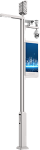
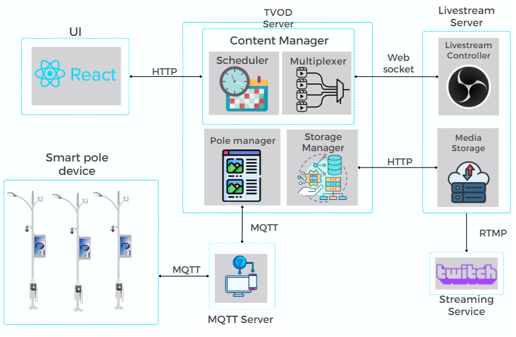
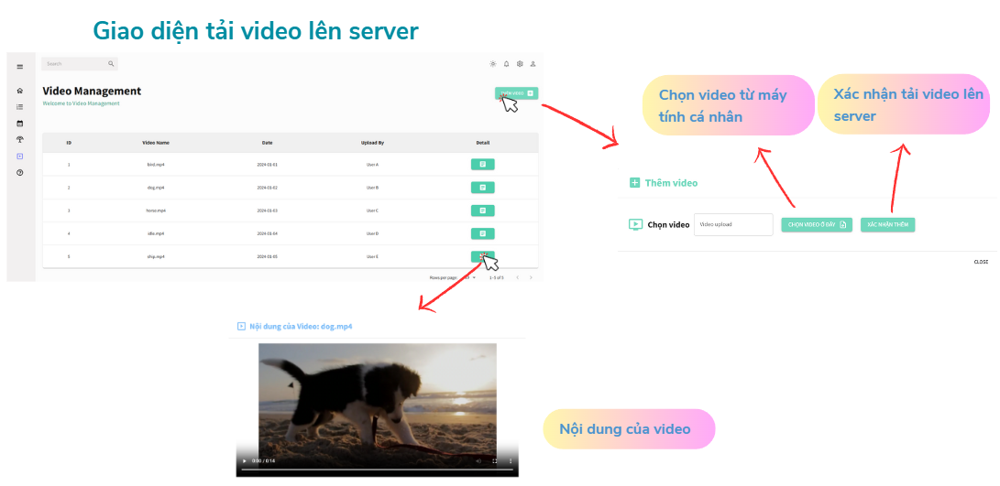
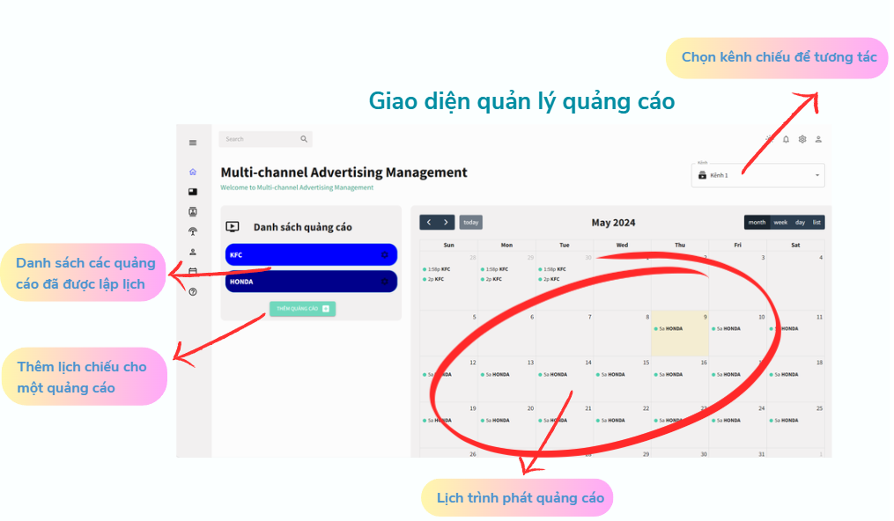
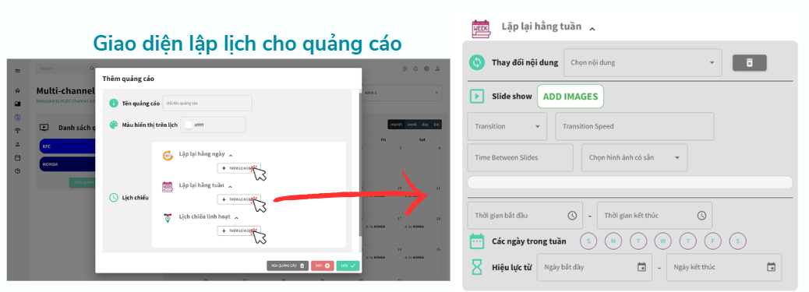
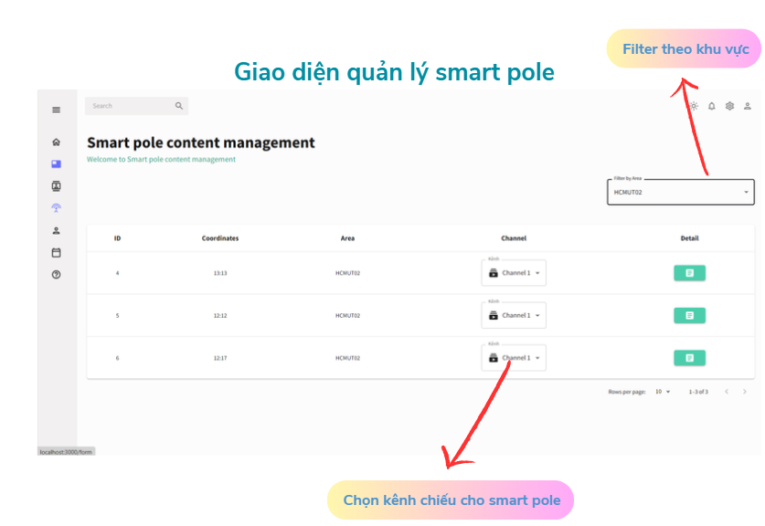
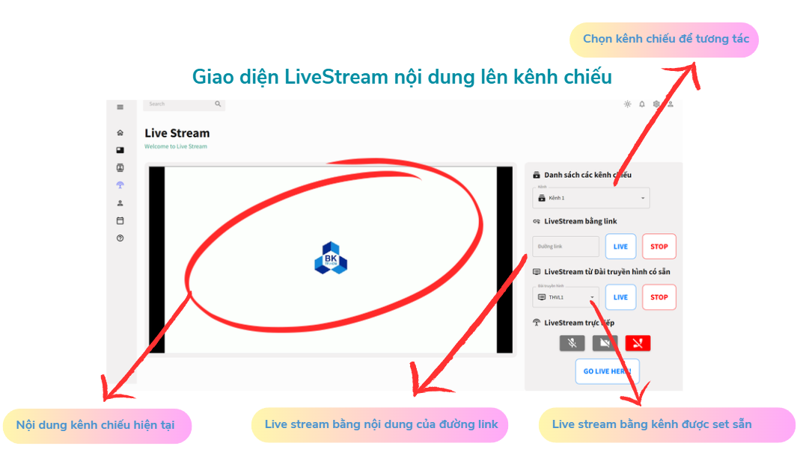
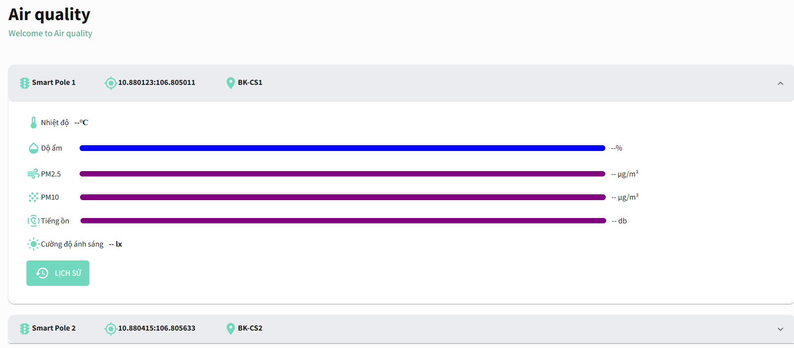

# Smart Pole System

## Introduction

The **Smart Pole System** is an innovative infrastructure solution designed to enhance urban spaces by providing dynamic content display and real-time streaming capabilities. Smart poles are street poles equipped with digital displays, sensors, and network connectivity, enabling them to deliver information, advertisements, and livestream events. This system facilitates remote management, scheduling, and control of the content displayed on these smart poles, allowing cities and organizations to engage with the public in a new, interactive way.

## System Architecture

The Smart Pole System consists of several key modules that work together to deliver and manage content on the poles. Each module has a specific role, from content scheduling to communication between devices. Below is a breakdown of each module and its functionality:

### 1. User Interface (UI)

- **Description**: The User Interface (UI) is built using React to provide an intuitive, interactive front end for managing the Smart Pole System.
- **Functions**:
  - Allows users to schedule, manage, and control the content displayed on smart poles.
  - Supports real-time monitoring of the system’s status.
  - Communicates with the **Content Manager** module via HTTP requests.
#### 1.1 Video Management

#### 1.2 Advertising Management

### 1.3 Smartpole Management

### 1.4 LiveStream

### 1.5 Air QUality

### 2. Content Manager

- **Description**: The Content Manager is the core of the system, managing content distribution and coordinating communication between different modules.
- **Components**:
  - **Scheduler**: Manages the timing of content delivery, enabling users to set schedules for displaying different media on the smart poles.
  - **Multiplexer**: Combines multiple content sources or channels, allowing different media types (images, videos, text) to be displayed on the poles.
  - **Pole Manager**: Manages the configuration and status of each smart pole, monitoring connections and ensuring that each pole receives the correct content.
  - **Storage Manager**: Stores media content, such as images and videos, used for display on the smart poles.
- **Communication**: Connects with the **UI** via HTTP and **Smart Poles** via MQTT for content distribution and status updates.

### 3. Livestream Server

- **Description**: The Livestream Server manages real-time broadcasting, enabling live video to be streamed directly to the smart poles and online platforms.
- **Components**:
  - **Livestream Controller**: Controls live video feeds, starting, stopping, and managing streams sent to the poles or online.
  - **Media Storage**: Stores live-streamed content temporarily or for later use, supporting integration with external platforms.
- **Communication**: Connects to the **Content Manager** via WebSocket and supports RTMP streaming to services like Twitch.

### 4. Smart Pole Devices

- **Description**: Smart poles are the physical units installed in urban areas, each equipped with a display and connected to the central system.
- **Functions**:
  - Display scheduled content, advertisements, and real-time video streams.
  - Collect data from environmental sensors (if equipped) and send it to the Content Manager for monitoring.
- **Communication**: Connects to the **Content Manager** through the MQTT protocol, allowing for real-time updates and control.

### 5. MQTT Server

- **Description**: The MQTT Server facilitates communication between the **Content Manager** and the smart pole devices.
- **Functions**:
  - Handles lightweight, real-time messaging between the Content Manager and the smart poles.
  - Ensures reliable and efficient transmission of data, commands, and content between modules.

## Communication Flow

1. **UI to Content Manager**: The UI communicates with the Content Manager via HTTP requests, allowing users to configure content schedules, manage poles, and initiate livestreams.
2. **Content Manager to Smart Poles**: The Content Manager sends content and commands to the smart poles using the MQTT protocol, enabling real-time updates.
3. **Content Manager to Livestream Server**: The Content Manager uses WebSocket to connect with the Livestream Server, facilitating live video broadcasting to smart poles or external platforms.
4. **Livestream Server to Streaming Services**: The Livestream Server streams live content via RTMP to online platforms like Twitch, extending the system’s reach beyond the physical poles.
